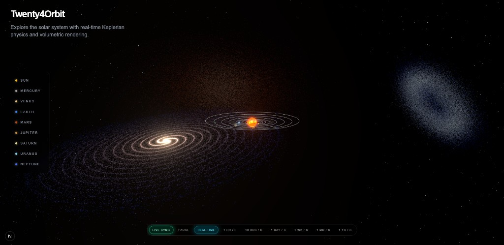
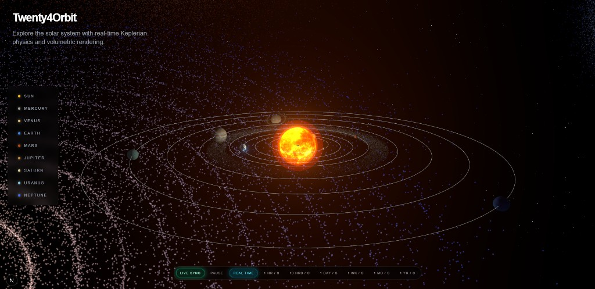
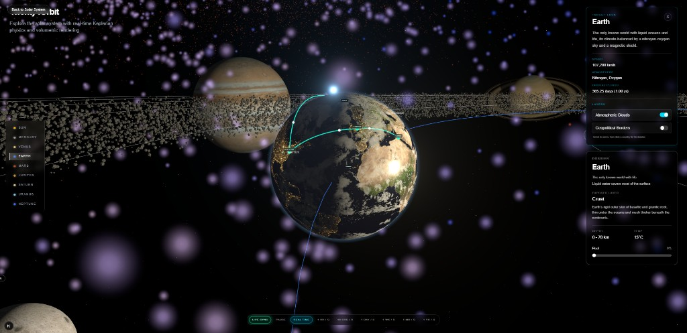

# Twenty4Orbit 🪐

A high-fidelity, interactive 3D solar system simulation built with React Three Fiber. Twenty4Orbit bridges the gap between cinematic visualizations and hardcore astrophysical data, offering a responsive dashboard to explore our cosmic neighborhood in real-time.

## 🚀 Key Features

*   **Astrophysical Accuracy:** Driven by Keplerian physics, planets follow true elliptical orbits with accurate semi-major axes, eccentricities, and real-world axial tilts.
*   **Volumetric & Custom Shaders:** Features custom Fresnel shaders for realistic atmospheric scattering, dynamic cloud layers that cast shadows on oceans, and mathematically driven galaxy dust clouds.
*   **High-Performance Rendering:** Handles massive graphical loads—including 8K photorealistic planetary maps and a seamless 50,000-instance asteroid belt—maintaining 60fps via WebGL InstancedMesh optimization.
*   **Interactive Dashboard:** A sleek, mobile-responsive UI featuring dynamic time-scaling (1 hour/sec to 1 year/sec), planetary layer toggles (geopolitical borders, clouds), and mathematically translated 3D surface pins for real-world coordinates.

## 🛠️ Tech Stack

*   **Frontend Framework:** Next.js, React, Tailwind CSS
*   **3D Rendering Engine:** Three.js, React Three Fiber, `@react-three/drei`
*   **State Management:** Zustand (for complex UI-to-Canvas state bridging)

## ⚙️ Local Setup

To run this simulation on your local machine:

1. Clone the repository: `git clone https://github.com/rbtech-solution/Twenty4Orbit.git`
2. Install the necessary dependencies: `npm install`
3. Boot up the development server: `npm run dev` and visit `localhost:3000`
